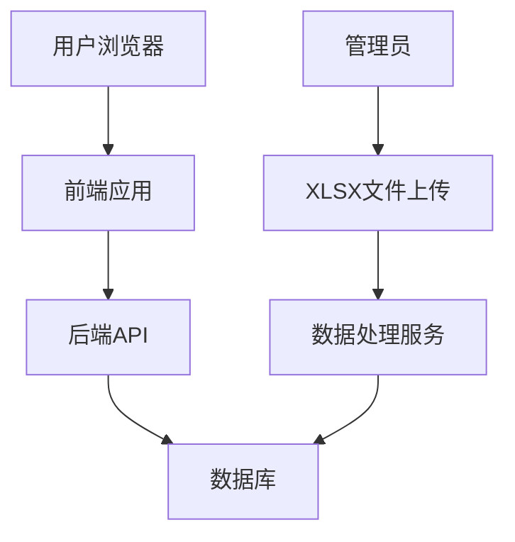
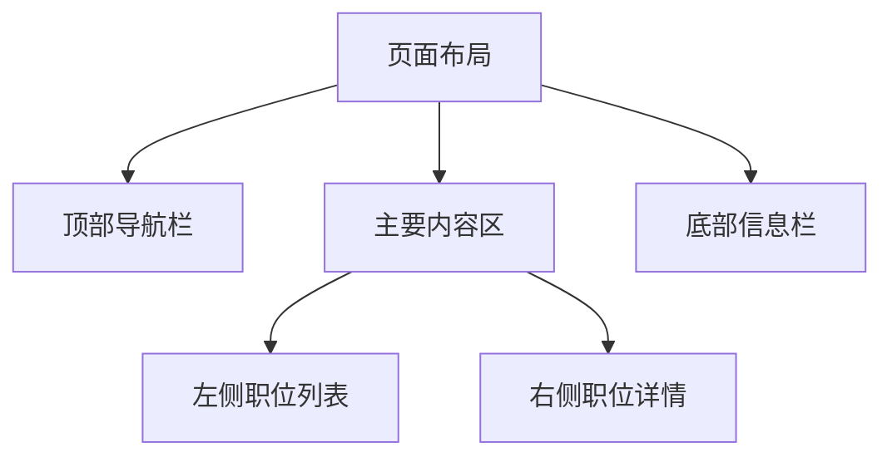
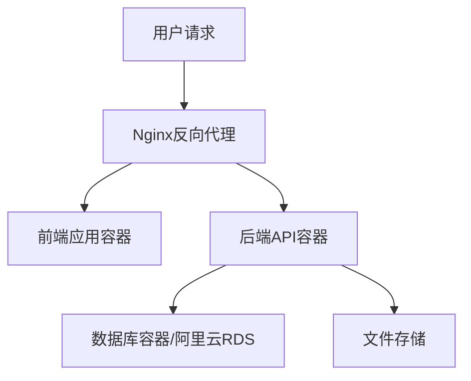

# 外企招聘平台设计文档

## 1. 概述

### 1.1 项目目标
开发一个外企招聘信息展示网站，支持管理员发布招聘信息，用户可登录注册或以游客身份浏览职位信息。网站采用类似LinkedIn的布局，左侧显示职位列表，右侧显示详细信息，并提供跳转到官方申请页面的功能。

### 1.2 核心功能
- 用户系统：注册、登录、游客浏览
- 职位展示：类似LinkedIn的布局展示职位信息
- 职位搜索：支持按公司名称、标题关键词、技能关键词、工作地点搜索
- 职位分页：每页默认显示30条记录
- 管理员功能：每日上传XLSX文件自动解析并插入数据库
- 管理员页面：可删除用户、删除职位信息
- 定时任务：每日晚上9点自动检查并处理XLSX文件
- 职位详情：展示职位描述、要求等信息，并提供官方申请按钮
- 响应式设计：便于转换为手机App和微信小程序

### 1.3 技术要求
- 数据库表根据XLSX文件结构创建
- 职位信息包含创建时间，过期时间为创建时间+60天
- 默认状态为active
- 部署环境：阿里云服务器

### 1.4 假设与依赖
- XLSX文件每日由管理员上传，文件名格式为日期（如2025-09-02.xlsx）
- XLSX文件包含职位相关信息的结构化数据
- 系统需要处理XLSX文件格式并提取数据
- 用户可以以游客身份浏览职位，注册用户可获得额外功能

## 2. 架构设计

### 2.1 系统架构图


### 2.2 技术栈选择
- 前端：React + TypeScript + TailwindCSS
- 后端：Node.js + Express + TypeScript
- 数据库：MySQL/PostgreSQL
- 部署：阿里云ECS + Docker容器化
- 移动端适配：响应式设计 + PWA支持

## 3. 数据模型设计

### 3.1 职位表 (jobs)
| 字段名 | 类型 | 描述 | 约束 |
|--------|------|------|------|
| id | BIGINT | 主键 | PRIMARY KEY, AUTO_INCREMENT |
| title | VARCHAR(255) | 职位标题 | NOT NULL |
| company_name | VARCHAR(255) | 公司名称 | NOT NULL |
| location | VARCHAR(255) | 工作地点 | NOT NULL |
| salary_range | VARCHAR(100) | 薪资范围 | NULL |
| skills | TEXT | 技能关键词 | NULL |
| description | TEXT | 职位描述 | NULL |
| requirements | TEXT | 职位要求 | NULL |
| job_apply_url | VARCHAR(500) | 官方申请链接 | NOT NULL |
| created_at | DATETIME | 创建时间 | NOT NULL, DEFAULT CURRENT_TIMESTAMP |
| expires_at | DATETIME | 过期时间 | NOT NULL |
| status | VARCHAR(20) | 状态 | NOT NULL, DEFAULT 'active' |

### 3.2 用户表 (users)
| 字段名 | 类型 | 描述 | 约束 |
|--------|------|------|------|
| id | BIGINT | 主键 | PRIMARY KEY, AUTO_INCREMENT |
| username | VARCHAR(50) | 用户名 | NOT NULL, UNIQUE |
| email | VARCHAR(100) | 邮箱 | NOT NULL, UNIQUE |
| password_hash | VARCHAR(255) | 密码哈希 | NOT NULL |
| role | VARCHAR(20) | 用户角色 | NOT NULL, DEFAULT 'user' |
| created_at | DATETIME | 创建时间 | NOT NULL, DEFAULT CURRENT_TIMESTAMP |
| last_login | DATETIME | 最后登录时间 | NULL |

### 3.3 XLSX文件结构假设
基于常见的职位信息发布格式，假设XLSX文件包含以下列：
- Title: 职位标题
- Company: 公司名称
- Location: 工作地点
- Salary Range: 薪资范围
- Skills: 技能关键词（如Python, Java等）
- Description: 职位描述
- Requirements: 职位要求
- Apply URL: 官方申请链接

### 3.4 数据处理流程


### 3.5 数据处理逻辑
1. 系统每日检查新上传的XLSX文件（文件名格式为YYYY-MM-DD.xlsx）
2. 解析XLSX文件内容，提取职位信息
3. 为每条记录添加创建时间（当前时间）
4. 计算过期时间（创建时间+60天）
5. 设置默认状态为active
6. 验证数据完整性，确保必填字段不为空
7. 如果薪水范围为空，则设置为"面议"
8. 将数据插入jobs表

## 4. 前端架构

### 4.1 组件结构
```
src/
├── components/
│   ├── layout/
│   │   ├── Header.tsx
│   │   ├── Footer.tsx
│   │   └── Sidebar.tsx
│   ├── job/
│   │   ├── JobList.tsx
│   │   ├── JobListItem.tsx
│   │   ├── JobSearch.tsx
│   │   ├── JobPagination.tsx
│   │   └── JobDetail.tsx
│   ├── user/
│   │   ├── Login.tsx
│   │   ├── Register.tsx
│   │   └── Profile.tsx
│   └── admin/
│       ├── AdminDashboard.tsx
│       ├── UserManagement.tsx
│       └── JobManagement.tsx
├── pages/
│   ├── Home.tsx
│   ├── Jobs.tsx
│   ├── Login.tsx
│   ├── Register.tsx
│   └── Admin.tsx
├── services/
│   └── api.ts
└── App.tsx
```

### 4.2 页面布局设计


### 4.3 职位列表组件设计
- JobList组件：负责获取和展示职位列表
- JobSearch组件：提供搜索功能
  - 公司名称搜索框
  - 标题关键词搜索框
  - 技能关键词搜索框
  - 工作地点搜索框
  - 搜索按钮
- JobPagination组件：提供分页功能
  - 每页默认显示30条记录
  - 上一页/下一页按钮
  - 页码跳转
- JobListItem组件：展示单个职位的基本信息
  - 职位标题
  - 公司名称
  - 工作地点
  - 薪资范围
  - 发布时间（相对时间显示，如"3天前"）
  - 点击事件处理，选中后在右侧展示详情

### 4.4 职位详情组件设计
- JobDetail组件：展示职位详细信息
  - 职位标题和公司名称
  - 工作地点
  - 薪资范围
  - 职位描述
  - 职位要求
  - 官方申请按钮（链接到job_apply_url）
  - 发布时间
  
### 4.5 状态管理
- 使用React Context API进行全局状态管理
- 用户认证状态
- 职位数据状态
- 当前选中职位状态

## 5. 后端架构

### 5.1 API端点设计

#### 5.1.1 用户认证接口
| 端点 | 方法 | 描述 | 请求参数 | 响应 |
|------|------|------|------|------|
| /api/auth/register | POST | 用户注册 | {username, email, password} | {token, user} |
| /api/auth/login | POST | 用户登录 | {email, password} | {token, user} |
| /api/auth/logout | POST | 用户登出 | - | {message} |
| /api/auth/profile | GET | 获取用户信息 | - | {user} |

#### 5.1.2 职位接口
| 端点 | 方法 | 描述 | 请求参数 | 响应 |
|------|------|------|------|------|
| /api/jobs | GET | 获取职位列表 | {page, limit, company, title, skills, location, salaryRange} | {jobs, pagination} |
| /api/jobs/:id | GET | 获取职位详情 | - | {job} |
| /api/jobs/upload | POST | 管理员上传XLSX文件 | multipart/form-data | {message} |
| /api/jobs/:id | DELETE | 删除职位信息 | - | {message} |
| /api/jobs/expired | DELETE | 清理过期职位 | - | {count} |

#### 5.1.3 管理员接口
| 端点 | 方法 | 描述 | 请求参数 | 响应 |
|------|------|------|------|------|
| /api/admin/users | GET | 获取用户列表 | {page, limit} | {users, pagination} |
| /api/admin/users/:id | DELETE | 删除用户 | - | {message} |
| /api/admin/dashboard | GET | 管理员仪表板数据 | - | {dashboardData} |

### 5.2 业务逻辑层

#### 5.2.1 数据处理服务
1. 文件上传验证
   - 验证文件格式为XLSX
   - 验证文件大小限制
   - 验证上传权限（仅管理员）
2. XLSX文件解析
   - 使用xlsx或exceljs库解析文件
   - 提取工作表数据
   - 映射列名到数据库字段
3. 数据验证和清洗
   - 验证必填字段
   - 清洗和标准化数据格式
   - 去重处理
   - 薪资范围为空时设置为"面议"
4. 计算过期时间（创建时间+60天）
5. 设置默认状态为active
6. 数据入库
   - 批量插入优化
   - 事务处理确保数据一致性

#### 5.2.4 管理员服务
1. 用户管理
   - 获取用户列表（支持分页）
   - 删除用户
2. 职位管理
   - 删除职位信息
   - 更新职位状态

#### 5.2.2 职位服务
1. 职位列表查询（支持分页、筛选）
   - 分页支持（默认每页30条）
   - 搜索功能（按职位标题、公司名、技能关键词、工作地点等）
   - 过滤功能（按薪资范围等）
2. 职位详情查询
   - 根据ID获取职位详情
   - 过滤已过期职位（对游客）
3. 职位状态管理
   - 管理员可更新职位状态
4. 职位删除功能
   - 管理员可删除职位信息

#### 5.2.3 定时任务服务
1. 每日晚上9点自动检查并处理XLSX文件
   - 检查指定目录下是否有以当天日期命名的XLSX文件（如2025-09-02.xlsx）
   - 如果有文件则自动解析并插入数据库
   - 如果没有文件则不执行任何操作
2. 每日自动清理过期职位
   - 检查并删除过期的职位信息

### 5.3 中间件设计
- 身份验证中间件：验证JWT Token，区分用户角色
- 权限验证中间件：验证用户是否有权限访问特定接口（如管理员接口）
- 请求日志中间件：记录API访问日志
- 错误处理中间件：统一异常处理和响应格式
- 文件上传中间件：处理XLSX文件上传，限制文件大小和格式
- 请求频率限制中间件：防止API滥用

## 6. 移动端适配方案

### 6.1 响应式设计
- 使用TailwindCSS的响应式工具类
- 移动端优先的设计原则
- 触摸友好的交互设计
- 流式布局和弹性网格系统
- 媒体查询适配不同屏幕尺寸

### 6.2 PWA支持
- 添加Web App Manifest
- 实现Service Worker缓存策略
- 支持离线访问核心功能
- 添加到主屏幕功能
- 推送通知支持

### 6.3 小程序兼容性
- 使用通用组件库，便于移植到微信小程序
- 业务逻辑与UI分离
- 提供RESTful API供小程序调用
- 统一状态管理，便于多端同步
- 设计适配小程序的UI组件

### 6.4 移动端特殊考虑
- 点击延迟优化（使用Passive Event Listeners）
- 300ms点击延迟处理
- 移动端键盘适配
- 横竖屏适配
- 手势操作支持

## 7. 部署架构

### 7.1 部署环境
- 阿里云ECS服务器
- Docker容器化部署
- Nginx反向代理
- SSL证书配置
- 数据库独立部署或使用阿里云RDS

### 7.2 服务架构


### 7.3 CI/CD流程


### 7.4 监控与日志
- 应用性能监控（APM）
- 数据库性能监控
- 日志收集与分析（ELK Stack）
- 告警机制

## 8. 安全设计

### 8.1 认证与授权
- JWT Token认证
- 密码加密存储（bcrypt）
- 角色权限控制（用户/管理员）
  - 普通用户：浏览职位、搜索职位、查看职位详情
  - 管理员：所有用户功能 + 上传XLSX文件 + 删除用户 + 删除职位 + 访问管理员页面
- Session管理

### 8.2 数据安全
- SQL注入防护（使用ORM）
- XSS攻击防护（输入输出过滤）
- 文件上传安全检查（格式、大小、内容）
- 敏感信息加密存储

### 8.3 API安全
- 请求频率限制
- 输入验证和过滤
- HTTPS加密传输
- CORS策略配置
- API版本控制

### 8.4 网络安全
- 防火墙配置
- DDoS防护
- 定期安全扫描
- 数据备份策略

## 9. 性能优化

### 9.1 前端优化
- 代码分割和懒加载
- 图片优化和懒加载
- 浏览器缓存策略
- CDN加速静态资源
- 前端缓存策略（localStorage/sessionStorage）

### 9.2 后端优化
- 数据库索引优化
- API响应缓存（Redis）
- 数据库连接池
- 接口响应压缩（gzip）
- 批量操作优化

### 9.3 数据库优化
- 合理的索引设计
- 查询优化
- 定期清理过期数据
- 数据库读写分离
- 分页查询优化

## 10. 测试策略

### 10.1 前端测试
- 单元测试：使用Jest测试业务逻辑
- 组件测试：使用React Testing Library测试UI组件
- 端到端测试：使用Cypress进行用户流程测试

### 10.2 后端测试
- 单元测试：使用Jest测试业务逻辑
- 集成测试：测试API接口和数据库操作
- 性能测试：使用LoadTest进行压力测试

### 10.3 数据处理测试
- XLSX文件解析测试
- 数据验证和清洗测试
- 批量插入性能测试

### 10.4 安全测试
- 渗透测试
- 输入验证测试
- 权限控制测试