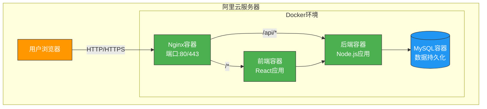

# 微服务容器化部署架构设计

## 1. 概述

为了提升FEJobHub项目的可扩展性、可维护性和部署便利性，本设计文档提出基于Docker容器的微服务架构部署方案。该方案将前端和后端应用分别容器化，便于在阿里云服务器上部署，并支持未来的功能扩展和版本升级。

### 1.1 设计目标

- 实现前后端应用的容器化部署
- 支持高并发访问（日访问量万次以上）
- 提供便捷的部署和升级机制
- 保证系统的可扩展性和可维护性
- 确保生产环境的稳定性和安全性

### 1.2 技术栈

- Docker: 容器化平台
- Docker Compose: 多容器应用编排
- Nginx: 反向代理和静态资源服务
- Node.js + Express: 后端服务
- React + Vite: 前端应用
- MySQL: 数据库服务

## 2. 架构设计

### 2.1 整体架构图



### 2.2 组件说明

1. **Nginx容器**: 作为反向代理和负载均衡器，处理静态资源服务和API请求转发
2. **前端容器**: 运行React应用，提供用户界面
3. **后端容器**: 运行Node.js Express服务，处理业务逻辑和数据接口
4. **MySQL容器**: 数据库服务，存储用户信息、职位数据等

## 3. 容器化实现

### 3.1 后端Docker化

#### Dockerfile (backend/Dockerfile)

```dockerfile
FROM node:16-alpine

WORKDIR /app

# 复制package文件并安装依赖
COPY package*.json ./
RUN npm ci --only=production

# 复制应用代码
COPY . .

# 创建datasource目录
RUN mkdir -p ../datasource

# 暴露端口
EXPOSE 3001

# 启动命令
CMD ["npm", "start"]
```

#### 环境变量配置 (.env)

```env
NODE_ENV=production
PORT=3001
DB_HOST=mysql
DB_PORT=3306
DB_NAME=fejobhub
DB_USER=root
DB_PASSWORD=your_mysql_password
JWT_SECRET=your_jwt_secret_key
UPLOAD_PATH=./uploads
```

### 3.2 前端Docker化

#### Dockerfile (frontend/Dockerfile)

```dockerfile
# 构建阶段
FROM node:16-alpine as build

WORKDIR /app

# 复制package文件并安装所有依赖
COPY package*.json ./
RUN npm ci

# 复制源代码
COPY . .

# 构建生产版本
RUN npm run build

# 生产阶段
FROM nginx:alpine

# 复制构建产物到nginx目录
COPY --from=build /app/dist /usr/share/nginx/html

# 复制nginx配置
COPY nginx.conf /etc/nginx/conf.d/default.conf

# 暴露端口
EXPOSE 80

# 启动nginx
CMD ["nginx", "-g", "daemon off;"]
```

#### Nginx配置 (frontend/nginx.conf)

```nginx
server {
    listen 80;
    server_name localhost;
    
    location / {
        root /usr/share/nginx/html;
        index index.html index.htm;
        try_files $uri $uri/ /index.html;
    }
    
    location /api/ {
        proxy_pass http://backend:3001/;
        proxy_set_header Host $host;
        proxy_set_header X-Real-IP $remote_addr;
        proxy_set_header X-Forwarded-For $proxy_add_x_forwarded_for;
        proxy_set_header X-Forwarded-Proto $scheme;
    }
}
```

### 3.3 数据库容器化

使用官方MySQL镜像，通过Docker Compose进行配置。

## 4. 部署方案

### 4.1 Docker Compose编排

#### docker-compose.yml

```yaml
version: '3.8'

services:
  mysql:
    image: mysql:8.0
    container_name: fejobhub-mysql
    restart: always
    environment:
      MYSQL_ROOT_PASSWORD: your_mysql_password
      MYSQL_DATABASE: fejobhub
    ports:
      - "3306:3306"
    volumes:
      - mysql_data:/var/lib/mysql
    networks:
      - fejobhub-network

  backend:
    build: ./backend
    container_name: fejobhub-backend
    restart: always
    ports:
      - "3001:3001"
    environment:
      - NODE_ENV=production
      - DB_HOST=mysql
      - DB_PORT=3306
      - DB_NAME=fejobhub
      - DB_USER=root
      - DB_PASSWORD=your_mysql_password
      - JWT_SECRET=your_jwt_secret_key
    volumes:
      - ../datasource:/app/datasource
    depends_on:
      - mysql
    networks:
      - fejobhub-network

  frontend:
    build: ./frontend
    container_name: fejobhub-frontend
    restart: always
    ports:
      - "80:80"
    depends_on:
      - backend
    networks:
      - fejobhub-network

volumes:
  mysql_data:

networks:
  fejobhub-network:
    driver: bridge
```

### 4.2 部署步骤

1. **服务器环境准备**:
   ```bash
   # 更新系统
   sudo apt update && sudo apt upgrade -y
   
   # 安装Docker
   curl -fsSL https://get.docker.com -o get-docker.sh
   sudo sh get-docker.sh
   
   # 安装Docker Compose
   sudo curl -L "https://github.com/docker/compose/releases/download/v2.20.0/docker-compose-$(uname -s)-$(uname -m)" -o /usr/local/bin/docker-compose
   sudo chmod +x /usr/local/bin/docker-compose
   ```

2. **代码上传**:
   ```bash
   # 克隆或上传项目代码到服务器
   git clone https://github.com/your-username/FEJobHub.git
   cd FEJobHub
   ```

3. **配置环境变量**:
   ```bash
   # 在backend目录下创建.env文件
   cd backend
   vim .env
   # 填入相应的环境变量配置
   ```

4. **启动服务**:
   ```bash
   # 返回项目根目录
   cd ..
   
   # 构建并启动所有服务
   docker-compose up -d
   
   # 查看服务状态
   docker-compose ps
   ```

5. **初始化数据库**:
   ```bash
   # 进入后端容器
   docker exec -it fejobhub-backend sh
   
   # 运行数据库同步脚本
   node scripts/syncDatabase.js
   ```

## 5. 升级方案

### 5.1 前端升级流程

1. **代码更新**:
   ```bash
   # 拉取最新代码
   git pull origin main
   
   # 进入前端目录
   cd frontend
   ```

2. **重新构建镜像**:
   ```bash
   # 重新构建前端镜像
   docker-compose build frontend
   
   # 停止并重新启动前端服务
   docker-compose up -d --no-deps frontend
   ```

### 5.2 后端升级流程

1. **代码更新**:
   ```bash
   # 拉取最新代码
   git pull origin main
   
   # 进入后端目录
   cd backend
   ```

2. **检查依赖变更**:
   ```bash
   # 如果package.json有变更，需要重新安装依赖
   docker-compose build backend
   ```

3. **重新部署服务**:
   ```bash
   # 停止并重新启动后端服务
   docker-compose up -d --no-deps backend
   
   # 如果有数据库迁移脚本，需要执行
   docker exec -it fejobhub-backend node scripts/migration.js
   ```

### 5.3 数据库升级

对于数据库结构变更，需要创建专门的迁移脚本:

1. **创建迁移脚本**:
   ```javascript
   // backend/scripts/migration.js
   const sequelize = require('../config/database');
   const Job = require('../models/Job');
   const User = require('../models/User');
   
   // 在这里添加数据库结构变更逻辑
   async function migrate() {
     try {
       // 示例：添加新字段
       // await sequelize.query('ALTER TABLE jobs ADD COLUMN is_featured BOOLEAN DEFAULT FALSE');
       console.log('数据库迁移完成');
     } catch (error) {
       console.error('数据库迁移失败:', error);
     } finally {
       await sequelize.close();
     }
   }
   
   migrate();
   ```

2. **执行迁移**:
   ```bash
   docker exec -it fejobhub-backend node scripts/migration.js
   ```

## 6. 性能与扩展性考虑

### 6.1 高并发支持

1. **Nginx负载均衡**: 可以配置多个前端和后端实例
2. **数据库连接池**: 后端应用使用连接池管理数据库连接
3. **缓存机制**: 可引入Redis缓存热点数据

### 6.2 水平扩展

1. **前端扩展**: 可以启动多个前端容器实例
2. **后端扩展**: 可以启动多个后端容器实例
3. **数据库扩展**: 可以使用主从复制或分片技术

### 6.3 监控与日志

1. **容器日志**: 使用Docker日志驱动收集容器日志
2. **应用监控**: 可集成Prometheus和Grafana进行监控
3. **健康检查**: Docker Compose中配置健康检查机制

## 7. 安全考虑

### 7.1 容器安全

1. **最小化镜像**: 使用alpine基础镜像减少攻击面
2. **非root用户**: 在容器中使用非root用户运行应用
3. **定期更新**: 定期更新基础镜像和依赖包

### 7.2 网络安全

1. **网络隔离**: 使用Docker网络隔离不同服务
2. **防火墙配置**: 配置服务器防火墙只开放必要端口
3. **HTTPS支持**: 配置SSL证书启用HTTPS

### 7.3 数据安全

1. **数据持久化**: 使用Docker卷持久化重要数据
2. **备份策略**: 定期备份数据库和重要文件
3. **访问控制**: 限制对敏感端口和文件的访问