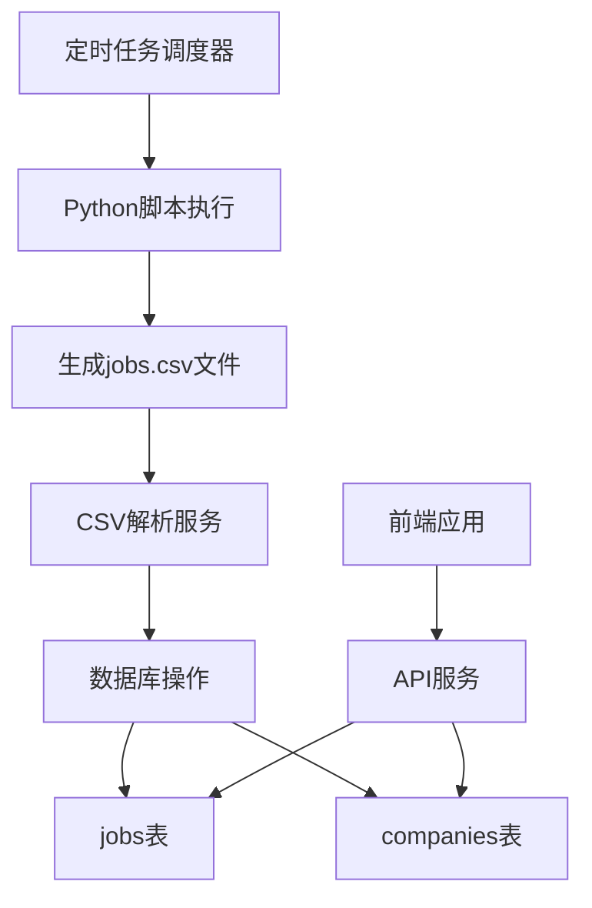

# 任务移除和数据处理功能设计文档

## 1. 概述

本文档描述了对FEJobHub系统的改进需求，包括：
1. 移除原有的XLSX文件定时处理任务
2. 修改Python脚本以添加CSV文件备份功能
3. 创建新的定时任务来执行Python脚本并处理生成的CSV文件
4. 修改数据库模型，添加is_remote字段
5. 调整前端显示以支持remote标志和改进职位详情展示

## 2. 架构设计

### 2.1 系统架构图



### 2.2 组件说明

1. **定时任务调度器**: 使用node-schedule库调度每日任务
2. **Python脚本**: 执行网络爬虫并生成jobs.csv文件
3. **CSV解析服务**: 解析CSV文件并处理数据
4. **数据库操作**: 将处理后的数据插入数据库
5. **API服务**: 为前端提供数据接口

## 3. 功能设计

### 3.1 移除原有XLSX定时任务

移除`backend/services/cronService.js`中的`processDailyExcelFile`方法及相关调度代码。

### 3.2 Python脚本修改

修改`backend/datasource/test-job-spy.py`脚本，添加以下功能：
1. 在执行爬虫前检查当前目录是否存在jobs.csv文件
2. 如果存在，将文件移动到上级目录的databackup文件夹中
3. 使用时间戳重命名备份文件

### 3.3 新的定时任务

创建新的定时任务，每日执行Python脚本并处理生成的CSV文件：
1. 每日凌晨2点执行Python脚本
2. 解析生成的jobs.csv文件
3. 处理数据并插入数据库

### 3.4 数据库模型修改

在jobs表中添加is_remote布尔型字段，默认值为FALSE。

### 3.5 前端显示调整

1. 在职位列表和详情页面显示remote标志
2. 在职位详情页面移除"职位描述"和"职位要求"标题

## 4. 数据模型设计

### 4.1 jobs表结构修改

在现有jobs表基础上添加is_remote字段：

| 字段名 | 类型 | 描述 | 约束 |
|--------|------|------|------|
| is_remote | BOOLEAN | 是否支持远程工作 | NOT NULL, DEFAULT FALSE |

### 4.2 CSV数据映射关系

| CSV字段 | 数据库字段 | 处理逻辑 |
|---------|------------|----------|
| company | company_name | 直接映射 |
| title | title | 直接映射 |
| location | location | 解析C+数字格式，查找location.json对应值 |
| description | description | HTML格式，直接存储 |
| requirements | requirements | 可为空 |
| job_url_direct | job_apply_url | 去除utm_source=indeed及之后字符 |
| is_remote | is_remote | 直接映射 |

## 5. 业务逻辑设计

### 5.1 Python脚本备份逻辑

```python
import os
import shutil
from datetime import datetime

# 检查jobs.csv是否存在
if os.path.exists('jobs.csv'):
    # 创建备份目录
    backup_dir = '../databackup'
    if not os.path.exists(backup_dir):
        os.makedirs(backup_dir)
    
    # 生成带时间戳的备份文件名
    timestamp = datetime.now().strftime('%Y%m%d_%H%M%S')
    backup_filename = f'jobs_backup_{timestamp}.csv'
    backup_path = os.path.join(backup_dir, backup_filename)
    
    # 移动文件
    shutil.move('jobs.csv', backup_path)
```

### 5.2 CSV解析逻辑

1. 读取CSV文件
2. 解析location字段中的C+数字格式（如C22）
3. 查找location.json中的对应值
4. 处理job_apply_url，去除utm_source=indeed及之后字符
5. 检查company是否存在于companies表中
6. 如果不存在，则使用company_url_direct作为career_url插入新记录
7. 将数据插入jobs表

### 5.3 定时任务逻辑

```javascript
// 每天凌晨2点执行
schedule.scheduleJob('0 0 2 * * *', async () => {
  // 执行Python脚本
  // 解析生成的CSV文件
  // 插入数据库
});
```

## 6. API接口设计

### 6.1 职位列表接口

GET `/api/jobs`

响应数据结构：
```json
{
  "jobs": [
    {
      "id": 1,
      "title": "Software Engineer",
      "company_name": "Tech Corp",
      "location": "Beijing",
      "salary_range": "面议",
      "is_remote": true,
      "created_at": "2023-05-01T00:00:00Z"
    }
  ]
}
```

### 6.2 职位详情接口

GET `/api/jobs/:id`

响应数据结构：
```json
{
  "id": 1,
  "title": "Software Engineer",
  "company_name": "Tech Corp",
  "location": "Beijing",
  "salary_range": "面议",
  "description": "<p>Job description in HTML format</p>",
  "requirements": "<p>Job requirements in HTML format</p>",
  "job_apply_url": "https://example.com/apply",
  "is_remote": true,
  "created_at": "2023-05-01T00:00:00Z"
}
```

## 7. 前端组件设计

### 7.1 JobListItem组件修改

在职位列表项中添加remote标志显示：

```jsx
<div className="job-meta">
  {job.is_remote && <span className="remote-badge">Remote</span>}
  <span className="job-location">{job.location}</span>
</div>
```

### 7.2 JobDetail组件修改

移除"职位描述"和"职位要求"标题：

```jsx
<div className="job-content">
  {job.description && (
    <div className="job-section">
      <div className="job-description" dangerouslySetInnerHTML={{ __html: job.description }} />
    </div>
  )}
  
  {job.requirements && (
    <div className="job-section">
      <div className="job-requirements" dangerouslySetInnerHTML={{ __html: job.requirements }} />
    </div>
  )}
</div>
```

## 8. 测试策略

### 8.1 单元测试

1. 测试CSV解析逻辑
2. 测试location字段解析
3. 测试job_apply_url处理逻辑
4. 测试数据库插入逻辑

### 8.2 集成测试

1. 测试定时任务执行流程
2. 测试Python脚本执行和备份功能
3. 测试前端显示remote标志
4. 测试职位详情页面显示

### 8.3 端到端测试

1. 验证完整的数据处理流程
2. 验证前端页面显示效果

## 4. 数据模型设计

### 4.1 jobs表结构修改

在现有jobs表基础上添加is_remote字段：

| 字段名 | 类型 | 描述 | 约束 |
|--------|------|------|------|
| is_remote | BOOLEAN | 是否支持远程工作 | NOT NULL, DEFAULT FALSE |

### 4.2 CSV数据映射关系

| CSV字段 | 数据库字段 | 处理逻辑 |
|---------|------------|----------|
| company | company_name | 直接映射 |
| title | title | 直接映射 |
| location | location | 解析C+数字格式，查找location.json对应值 |
| description | description | HTML格式，直接存储 |
| requirements | requirements | 可为空 |
| job_url_direct | job_apply_url | 去除utm_source=indeed及之后字符 |
| is_remote | is_remote | 直接映射 |

## 5. 业务逻辑设计

### 5.1 Python脚本备份逻辑

```python
import os
import shutil
from datetime import datetime

# 检查jobs.csv是否存在
if os.path.exists('jobs.csv'):
    # 创建备份目录
    backup_dir = '../databackup'
    if not os.path.exists(backup_dir):
        os.makedirs(backup_dir)
    
    # 生成带时间戳的备份文件名
    timestamp = datetime.now().strftime('%Y%m%d_%H%M%S')
    backup_filename = f'jobs_backup_{timestamp}.csv'
    backup_path = os.path.join(backup_dir, backup_filename)
    
    # 移动文件
    shutil.move('jobs.csv', backup_path)
```

### 5.2 CSV解析逻辑

1. 读取CSV文件
2. 解析location字段中的C+数字格式
3. 查找location.json中的对应值
4. 处理job_apply_url，去除utm_source=indeed及之后字符
5. 检查company是否存在于companies表中
6. 如果不存在，则插入新记录
7. 将数据插入jobs表

### 5.3 定时任务逻辑

```javascript
// 每天凌晨2点执行
schedule.scheduleJob('0 0 2 * * *', async () => {
  // 执行Python脚本
  // 解析生成的CSV文件
  // 插入数据库
});
```

## 6. API接口设计

### 6.1 职位列表接口

GET `/api/jobs`

响应数据结构：
```json
{
  "jobs": [
    {
      "id": 1,
      "title": "Software Engineer",
      "company_name": "Tech Corp",
      "location": "Beijing",
      "salary_range": "面议",
      "is_remote": true,
      "created_at": "2023-05-01T00:00:00Z"
    }
  ]
}
```

### 6.2 职位详情接口

GET `/api/jobs/:id`

响应数据结构：
```json
{
  "id": 1,
  "title": "Software Engineer",
  "company_name": "Tech Corp",
  "location": "Beijing",
  "salary_range": "面议",
  "description": "<p>Job description in HTML format</p>",
  "requirements": "<p>Job requirements in HTML format</p>",
  "job_apply_url": "https://example.com/apply",
  "is_remote": true,
  "created_at": "2023-05-01T00:00:00Z"
}
```

## 7. 前端组件设计

### 7.1 JobListItem组件修改

在职位列表项中添加remote标志显示：

```jsx
<div className="job-meta">
  {job.is_remote && <span className="remote-badge">Remote</span>}
  <span className="job-location">{job.location}</span>
</div>
```

### 7.2 JobDetail组件修改

移除"职位描述"和"职位要求"标题：

```jsx
<div className="job-content">
  {job.description && (
    <div className="job-section">
      <div className="job-description" dangerouslySetInnerHTML={{ __html: job.description }} />
    </div>
  )}
  
  {job.requirements && (
    <div className="job-section">
      <div className="job-requirements" dangerouslySetInnerHTML={{ __html: job.requirements }} />
    </div>
  )}
</div>
```

## 8. 测试策略

### 8.1 单元测试

1. 测试CSV解析逻辑
2. 测试location字段解析
3. 测试job_apply_url处理逻辑
4. 测试数据库插入逻辑

### 8.2 集成测试

1. 测试定时任务执行流程
2. 测试Python脚本执行和备份功能
3. 测试前端显示remote标志
4. 测试职位详情页面显示

### 8.3 端到端测试

1. 验证完整的数据处理流程
2. 验证前端页面显示效果