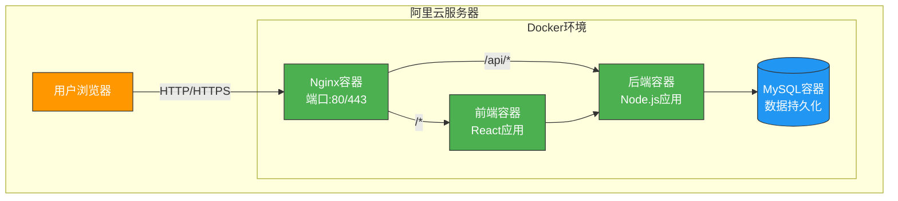

# FEJobHub 微服务容器化架构设计

## 1. 概述

为了提升FEJobHub项目的可扩展性、可维护性和部署便利性，我们采用了基于Docker容器的微服务架构部署方案。该方案将前端和后端应用分别容器化，便于在阿里云服务器上部署，并支持未来的功能扩展和版本升级。

## 2. 设计目标

- 实现前后端应用的容器化部署
- 支持高并发访问（日访问量万次以上）
- 提供便捷的部署和升级机制
- 保证系统的可扩展性和可维护性
- 确保生产环境的稳定性和安全性

## 3. 技术栈

- Docker: 容器化平台
- Docker Compose: 多容器应用编排
- Nginx: 反向代理和静态资源服务
- Node.js + Express: 后端服务
- React + Vite: 前端应用
- MySQL: 数据库服务

## 4. 架构设计

### 4.1 整体架构图

### 4.2 组件说明

1. **Nginx容器**: 作为反向代理和负载均衡器，处理静态资源服务和API请求转发
2. **前端容器**: 运行React应用，提供用户界面
3. **后端容器**: 运行Node.js Express服务，处理业务逻辑和数据接口
4. **MySQL容器**: 数据库服务，存储用户信息、职位数据等

## 5. 容器化实现

### 5.1 后端Docker化

后端使用Node.js Alpine镜像作为基础，通过以下步骤实现容器化：

1. 安装生产环境依赖
2. 复制应用代码
3. 创建必要的目录结构
4. 暴露3001端口
5. 设置启动命令

### 5.2 前端Docker化

前端采用多阶段构建：

1. **构建阶段**: 使用Node.js Alpine镜像安装依赖并构建生产版本
2. **生产阶段**: 使用Nginx Alpine镜像作为基础，复制构建产物并配置反向代理

### 5.3 数据库容器化

使用官方MySQL 8.0镜像，通过环境变量配置数据库参数，并通过初始化脚本自动创建数据库和用户。

## 6. 网络和数据持久化

### 6.1 网络配置

所有服务通过自定义Docker网络`fejobhub-network`进行通信，确保服务间安全隔离。

### 6.2 数据持久化

- MySQL数据通过`mysql_data`卷持久化存储
- 后端上传文件通过`backend_uploads`卷持久化存储
- 数据源文件通过绑定挂载共享给后端容器

## 7. 环境变量配置

通过环境变量管理不同环境的配置，包括数据库连接信息、JWT密钥等敏感信息。

## 8. 部署优势

### 8.1 一致性
- 开发、测试、生产环境一致性
- 消除"在我机器上能运行"的问题

### 8.2 可扩展性
- 支持水平扩展
- 可轻松增加服务实例

### 8.3 可维护性
- 独立部署和升级各服务
- 快速回滚到历史版本

### 8.4 资源利用率
- 容器资源共享
- 更高的硬件资源利用率

## 9. 安全考虑

### 9.1 容器安全
- 使用最小化基础镜像
- 定期更新基础镜像和依赖

### 9.2 网络安全
- 服务间网络隔离
- 限制端口暴露

### 9.3 数据安全
- 数据卷持久化重要数据
- 敏感信息通过环境变量管理